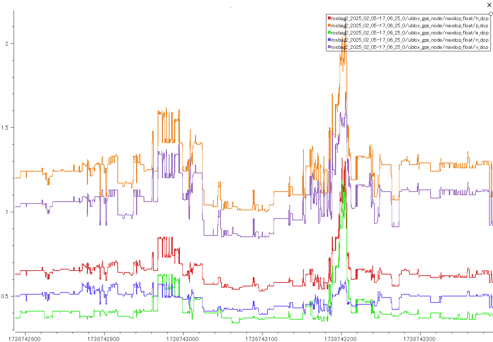
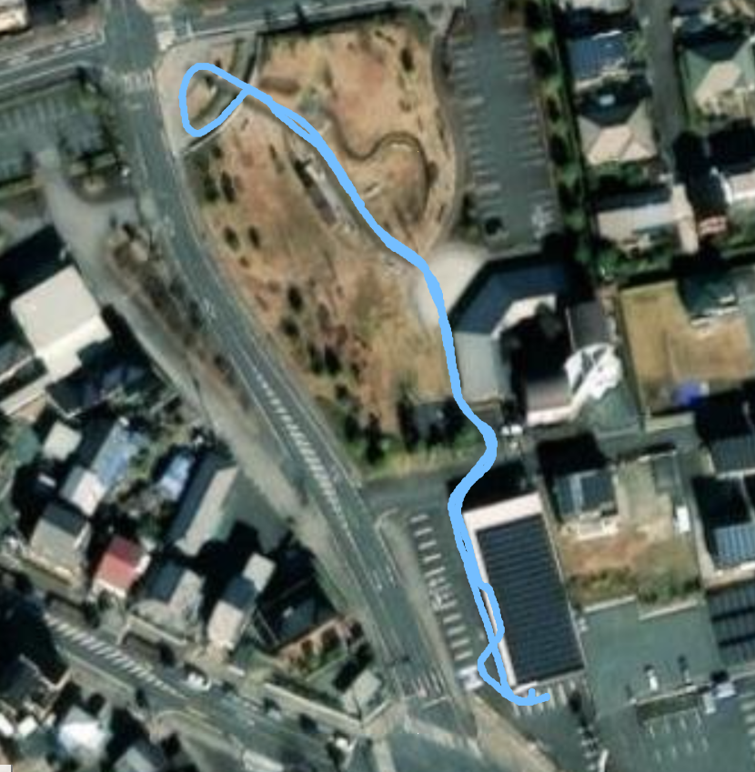
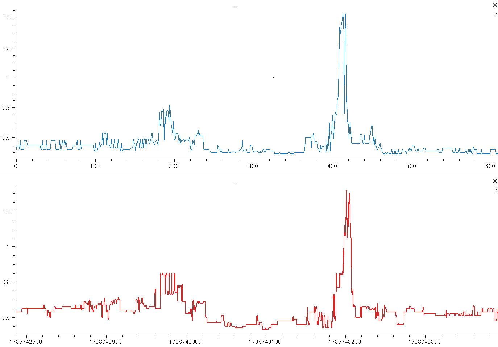
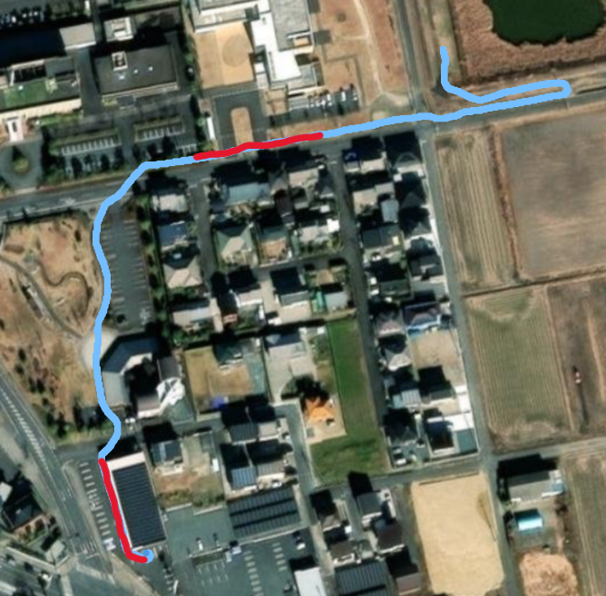
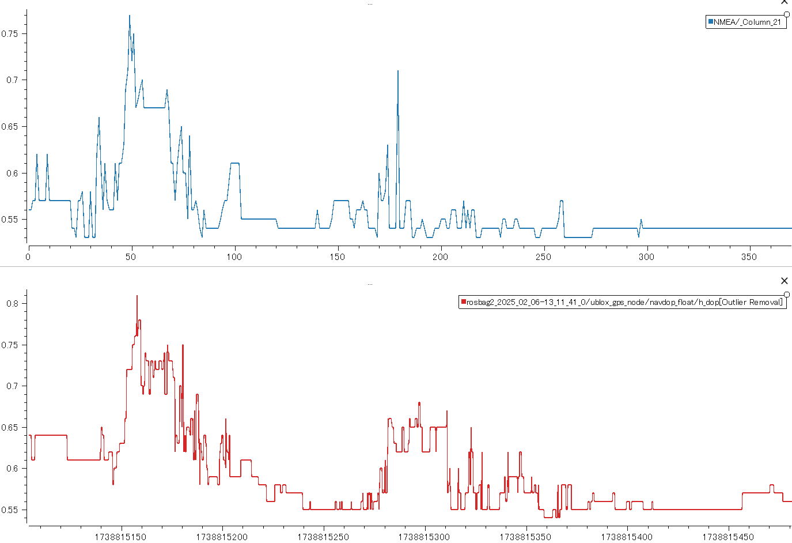
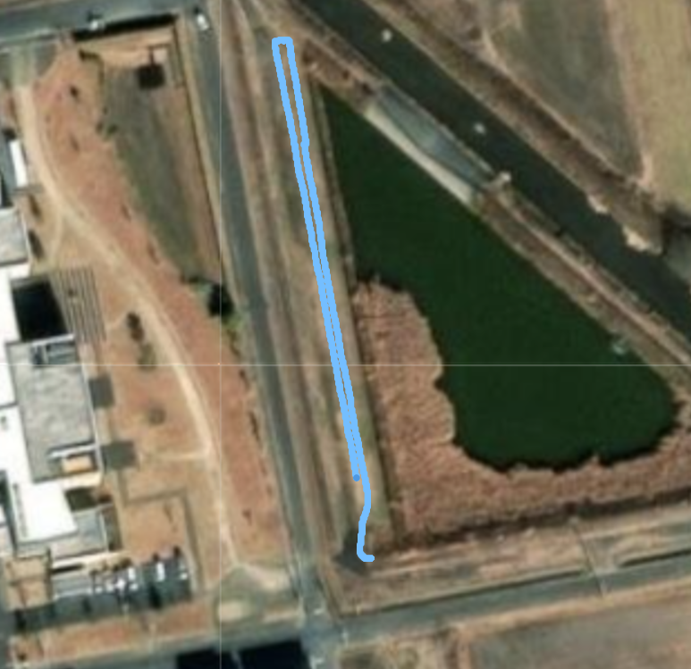
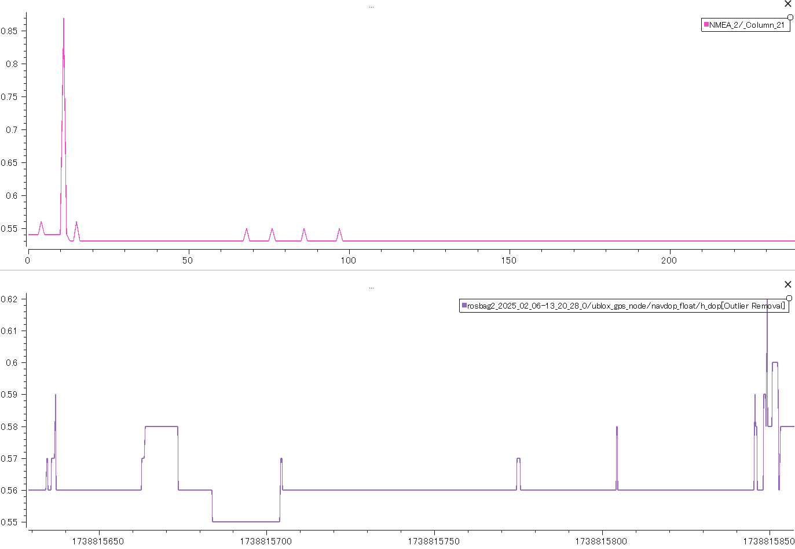

# GPS走行の精度評価

GPS評価の方針を立てたため、実際に評価試験を行っていく。暫定スペックを提示することで検収とする。

## AutoDriveのDOP可視化

DOPと走行精度の評価試験に向けて、DOPをROSから取り出せるようにする。またDOPにも複数種類があり、どのDOPを評価に使用するか方針を立てる。各DOPのデータと方針を示し、検収とする。

### 作業報告

#### #2025.01.30

U-bloxライブラリにDOPのmessageは定義されているが、publishする機能が見つからない。現状だとROSが受け取ることができないか…？

[参照：ublox 2.3.0](https://github.com/KumarRobotics/ublox/tree/2.3.0)

対応案：

1. もう少し調べてみる
2. 直接NMEAをパースして受け取る
3. covarianceで評価する

#### #2025.02.03

ubloxライブラリを編集し、DOPのmessageをpublishすることができた。

現状、

```bash
ros2 topic echo /navdop
```

で各DOPを受け取ることができる。

※受信したmessageはuint16_tであり、実際の値を100倍したものであることに注意。（実際のHDOP：1.67 → topicで受け取る値：167）

[次のタスク]

ログでプロット比較できるようにデータを成型する必要がある。

#### #2025.02.05

navDOP.msgの各DOPの型がuint16のため、float32型用にカスタムメッセージnavDOPFloat.msgを追加。

入力：
```bash
ros2 topic echo /ublox_gps_node/navdop_float
```
出力：
```
---
i_tow: 278855200
g_dop: 2.059999942779541
p_dop: 1.6999999284744263
t_dop: 1.1699999570846558
v_dop: 1.4800000190734863
h_dop: 0.8399999737739563
n_dop: 0.6899999976158142
e_dop: 0.47999998927116394
---
```

[参照：NAVDOP message](https://docs.ros.org/en/iron/p/ublox_msgs/interfaces/msg/NavDOP.html) 

※対象gitリポジトリ：

* [ublox (ros2 branch)](https://github.com/M2labo/ublox)
* [mm_gnss_localization (raspi5,main branchにpush)](https://github.com/M2labo/mm/tree/raspi5)

rosbagとしてログを取得し、プロットすることができた。

参考までにMM1.0の取得データから各DOPをプロットしたのが、下図である。



<br>

ここから、どのDOPが良いかの判断はできない。色々な指標を今後も確認しながらも、現段階ではHDOPを精度評価に用いる方向で進めたい。

## ichimillとDOPの比較

現行機とichimillとのDOPを比較し、ichimillの評価を終了する。ichimillを使用するか、現行機で開発を進めていくかの方針を立てて検収とする。

### 作業報告

#### #2025.02.05

ichimillとのデータ比較のため、下記ルートで走行した。



<br>

その時のHDOPデータが下図。上がichimill、下がMM1.0のHDOPデータ。



DBaseの屋根下を走行している間、HDOPが目立って大きくなる結果となった。

HDOPの挙動は両者に違いがないことから、MM1.0のHDOPでGPS精度を評価することができそうである。

またSAPOTでichimillを使用している実績があることも含めて、現状のGPSセットアップで問題ないと判断できるのではないか。

## テスト場所選定

### 作業報告

#### #2025.02.06

候補に挙がった、[メロ―プラザ横](https://maps.app.goo.gl/SysKDzsXGUp7uDQ29)について、

実際に車体を走行させてみてのHDOPをプロットした。

なお、メロ―プラザ横は当初想定した試験場所選定要素を満たしていると考える。

直線距離：約100 m


1. DBaseからmellowplazaまで

走行ルート：赤線部はHDOPのピークが立っている周辺



<br>

HDOP:



<br>
2. mellowplaza横

走行ルート：



<br>

HDOP:



### 所感

HDOPの値が0.6未満で安定しており、ichimillのHDOPの下限値が0.53辺りのようである（のように見える）ことから、Dbase周辺での試験場所として良いと判断。

ただあくまでもHDOPがGPS測位精度の目安であることを前提として、他のGPSに関わるデータも引き続き確認しながら、より精度として使いやすい指標があれば、代替する場合もある。
