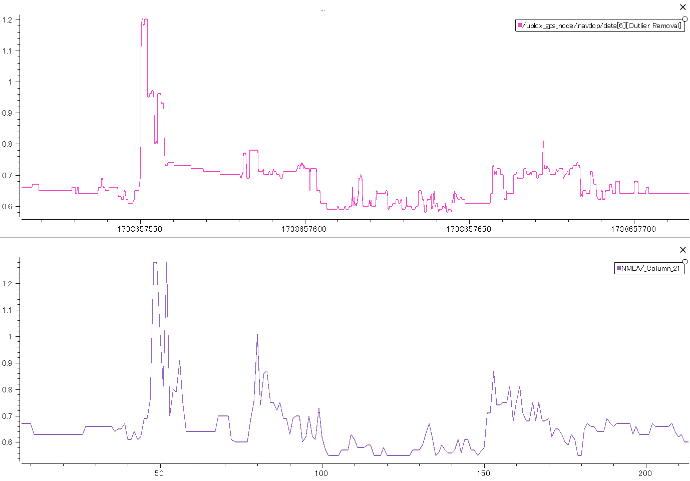

# GPS走行の精度評価

GPS評価の方針を立てたため、実際に評価試験を行っていく。暫定スペックを提示することで検収とする。

## AutoDriveのDOP可視化

DOPと走行精度の評価試験に向けて、DOPをROSから取り出せるようにする。またDOPにも複数種類があり、どのDOPを評価に使用するか方針を立てる。各DOPのデータと方針を示し、検収とする。

### 作業報告

#### #2025.01.30

U-bloxライブラリにDOPのmessageは定義されているが、publishする機能が見つからない。現状だとROSが受け取ることができないか…？

[参照：ublox 2.3.0](https://github.com/KumarRobotics/ublox/tree/2.3.0)

対応案：

1. もう少し調べてみる
2. 直接NMEAをパースして受け取る
3. covarianceで評価する

#### #2025.02.03

ubloxライブラリを編集し、DOPのmessageをpublishすることができた。

現状、

```bash
ros2 topic echo /navdop
```

で各DOPを受け取ることができる。

※受信したmessageはuint16_tであり、実際の値を100倍したものであることに注意。（実際のHDOP：1.67 → topicで受け取る値：167）


※編集ファイル：  
* ublox_msgs/include/ublox_msgs/serialization.hpp
* ublox_gps/config/ublox_gps.yaml
* ublox_gps/include/ublox_gps/node.hpp
* ublox_gps/src/node.cpp


[次のタスク]

ログでプロット比較できるようにデータを成型する必要がある。

#### #2025.02.04

navDOP.msgの各DOPの型がuint16のため、float32型として別topicでpublishするように修正。

入力：
```bash
ros2 topic echo /ublox_gps_node/navdop
```
出力：
```
---
layout:
  dim: []
  data_offset: 0
data:
- 1.3199999332427979        (← gDOP)
- 1.149999976158142         (← pDOP)
- 0.6499999761581421        (← tDOP)
- 0.9799999594688416        (← vDOP)
- 0.5999999642372131        (← hDOP)
- 0.4899999797344208        (← nDOP)
- 0.3499999940395355        (← eDOP)
---
```

[参照：NAVDOP message](https://docs.ros.org/en/iron/p/ublox_msgs/interfaces/msg/NavDOP.html) 

※編集ファイル：
* mm_gnss_localization/src/gnss_status_publisher.cpp
* mm_gnss_localization/config/zed_f9p_rover.yaml

rosbagとしてログを取得し、プロットすることができた。図の上がMM1.0、下がichimill。



以上、DOPを可視化することができた。

各DOPをプロットしたのが、下図である。


  


