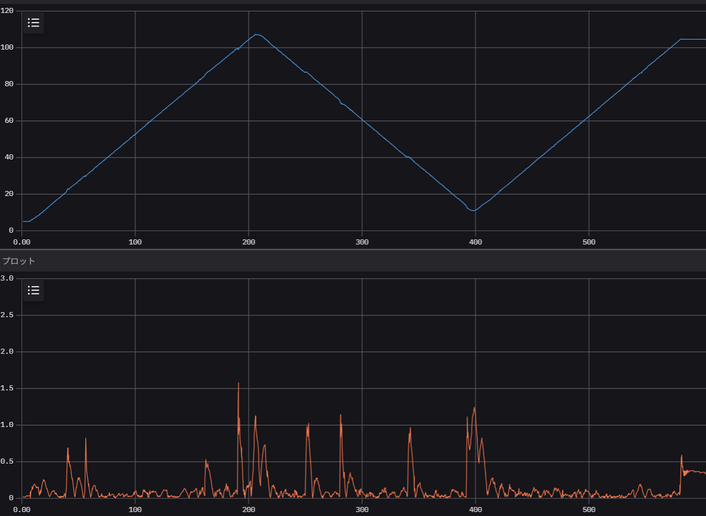

# 04. GPS走行の精度評価

DOPを可視化することができたため、暫定スペック値を決めるため走行試験を行っていく。暫定スペック値を決めることで検収とする。

## 経路追従評価用のtopic可視化

GPS座標の精度が良い状態であることを前提に、経路追従の評価を行うにあたって、誤差を可視化できるようにしたい。foxgloveで可視化できることを確認し検収とする。

### 作業報告

#### #2025.02.12

下記Nodeをlaunch fileで起動し、topicを可視化できるようにした。

[AutoDrive_Tools](https://github.com/M2labo/AutoDrive_Tools/blob/main/path_history_publisher/src/path_publisher.cpp)

対象のtopicは以下の通り。
```
/path_error
/path_history
```

#### #2025.02.13

1. 走行試験

    DBaseにて走行試験をしようとしたところ、テーブルを見ることはできたが

    評価をするにあたっての前準備が必要と感じる。特にアプリの不具合が残っている。

    アプリでのデバッグ評価はひとまず止めて、ターミナル上でのデバッグを進めていく。

    そのために、

    * ターミナルからのマップ作成
    * ターミナルからのマップ送信
    * ターミナルからワーク連携指示を含むマップ作成

    をできることを確認する。

2. 来週以降の課題

   * 経路追従誤差の可視化
   * UKFの改善
   * CAN通信のモジュールの改善が必要なのか？
   * 自律運転プログラムの自動起動
   * RaspiのDNSサーバ設定

#### #2025.02.19

0. 今週の決めたこと、やったこと

    * WorkのCAN interfaceプログラムは課題が現れるまで現状維持
    * WorkのONOFFをアプリから作成し、yamlファイルに書かれることまで確認した
    * Actionを含むroute.yamlを読み込み、実際に自律走行時にWorkのONOFFが切り替わることを確認した
    * 

1. 走行試験

    アプリが改善され、ルートをラズパイがダウンロードすることができたが、ルートと大きくずれた走行になる。

    原因を特定中。

    * 現在までに確認したこと
      * GPSのraw値はBase、Roverともに正しい
      * GPSのDOP値も安定している

    * 問題1: /tfの/base_linkと/odom/globalが一致しない
        → /odom から /base_linkの/tfを出力するノードが/ukf_node 以外に存在しているか？
      * 解決策: mobile_mover_nodeのパラメータenable_tfをfalseに
        （mobile_mover_ros_driver/config/mobile_mover_node.yaml）
      * 結果: /base_linkの/tfが/odom/globalに一致するように改善された
        |||
        |---|---|
        |bad||
        |good||

    * 問題2: 

2. 来週以降の課題

   * 経路追従誤差の可視化
   * UKFの改善
   * 自律運転プログラムの自動起動
   * RaspiのDNSサーバ設定


## 経路追従性の検証

### 作業報告

#### #2025.02.25

0. 今週決めたこと、やったこと

  * RaspiにmDNS設定をした

    ```
    sudo apt install systemd-resolved
    sudo apt purge avahi-daemon

    sudo vim /etc/systemd/resolved.conf
    -----------------------------------
    # MulticastDNS=no
    # LLMNR=no
      ↓↓↓ コメントアウトを外し、yesに
    MulticastDNS=yes
    LLMNR=yes
    -----------------------------------
    
    sudo vim /etc/hostname
    -----------------------------------
    ubuntu01
    -----------------------------------
    sudo vim /etc/hosts
    -----------------------------------
    # 下記を追加
    127.0.1.1    ubuntu01
    -----------------------------------

    ```
    結果：
    ```
    ssh m2labo@ubuntu01
    ```
    でアクセス可能に。

1. 走行試験

  * 問題：/odom/gpsの周期が想定の5Hzに到達しない。下記の調整をしてみたが、5Hzまで改善するがすぐ1.6Hzくらいに戻るという感じ
    * 受信機の設定：UBX-CFG-RATEのMeasurement Periodを150msに設定（Base、Rover両方）
    * navsat_transform.yamlのfrequencyを5.0に

#### 2025.03.05-06

0. 今週決めたこと、やったこと
  
  * AutoDriveGPSのフローチャート作成
  * モバイルルータの変更
    * microSIMを挿入後、USB経由でルータをPCと接続
    * APN設定
      * URL: http://192.168.179.1/
      * user: admin, pass: 筐体に記載
    * Raspi Ethernet接続
      * ```ip a``` で```eth0``` があることを確認後、
        
        ```sudo ifconfig eth0 up```

      * ```eth0``` が存在しない時は、
      * ```/etc/netplan/99-mobile.yaml``` に下記を追記
        ```
        ethernets:
          eth0:
            dhcp4: true
            dhcp4-overrides:
            route-metric: 100  # 優先度：小さいほうが優先度高
        ```
      * 設定の反映

        ```
        sudo netplan apply
        ```

1. 走行試験

  場所：メロ―プラザ横の遊水池

  rosbag: [rosbag2_2025_03_05-15_36_14](https://drive.google.com/file/d/1F0HZoiwD8iMtrlubPCLRFtwOvpGuyEe1/view?usp=drive_link)

  
  * 走行経路

      


  * HDOPのデータ: 0.6未満で推移している

    

  * /tfと/path_errorのグラフ（上：/tf、下：/path_error）
  
    /tfが所々跳んで、車体が左右に振れて/path_errorが大きくなっている

      

  場所：D-Base

  * パラメータ調整を行う
  

2. 来週以降の課題
   
    * /odom/gpsの周期が想定よりも低い原因を調査
    * DOPをGPSの評価に有用と判断し、暫定スペック値を設定する  

#### 2025.03.10-13

0. 今週決めたこと、やったこと
  * can.shをsystemdのサービスとして、起動時にcanのセットアップが自動的にされるようにした

    1. /etc/systemd/system/m2-can-interface.serviceを作成する
    ```ini
    [Unit]
    Description=Setup CAN interface can0
    After=network.target

    [Service]
    Type=oneshot
    ExecStart=/sbin/ip link set can0 type can bitrate 500000
    ExecStartPost=/sbin/ip link set can0 up
    RemainAfterExit=yes

    [Install]
    WantedBy=multi-user.target
              
    ```
    2. serviceを有効にする

    ```bash
    sudo systemctl enable bottom_led
    sudo systemctl start bottom_led
    ```


  * GPSをUSBハブに接続するように変更したところ、undervoltage detectedが消えた


1. 走行試験

  場所: DBase
  
  * 問題1: ukf.yamlのパラメータ調整による走行挙動の変化(position_covarianceの挙動を主に確認)

    * odom0_pose_rejection_threshold: 1.0-->2.0
      * rosbag2_2025_03_11-13_20_55
      * rosbag2_2025_03_11-13_35_52
      * rosbag2_2025_03_11-13_46_57
      * rosbag2_2025_03_11-13_49_25

      → これらはposition_covarianceのノイズは小さかった

    * odom0_pose_rejection_threshold: 2.0-->1.0
      * rosbag2_2025_03_11-13_58_44
      * rosbag2_2025_03_11-14_18_18

      → これらはposition_covarianceのノイズは大きかった

    * odom0_pose_rejection_threshold: 1.0-->2.0
      * rosbag2_2025_03_11-14_36_17

      → ノイズに影響を受けて、方向が乱れる

  遊水池で定点観測したが、ノイズが立つことを確認した

* 問題2: /odom/gpsの更新周期が想定よりも低い

  * 各topicの周期を調べてみる
    * /odom/gps: 1.3 Hz
    * /ublox_gps_node/fix: 6 Hz
    * /navheading: 6.5 Hz
    * /odom/global: 6.5 Hz
    * /tf: 6.5 Hz
    * /navdop: 6.5 Hz

    → ukf_nodeとnavsat_transform_nodeの部分でNaN値を授受していることが原因か？

    → inputのtopic(/navheading, /fix)

  * /navheadingのプロットを確認すると、orientation/z,wが時々1/√2（45deg）に跳ぶ挙動がみられる

    →ukf_nodeの計算に影響する？

    

    * rosbag2_2025_03_12-16_16_25_0

      → /navrelposned: 0を頻発

    * rosbag2_2025_03_12-16_53_44: ukf10hz
    * rosbag2_2025_03_12-17_22_37: ukf5Hz
    * rosbag2_2025_03_12-17_35_00: ukf6Hz
    * rosbag2_2025_03_12-17_51_54: ukf6Hz, use_odometry_yaw: false-->true
      

02. Asanaで報告としてまとめたコメント

* 問題1：週初めに走行試験をしてみたところ、経路から大きくずれて走行して中断したり、カーブで中断することが増えた

    →そこで、以前から時々出ていたnavsat_transform_nodeやukf_nodeでNaNを受け取るエラーに注目
    
    →/navrelposned (/navheading)でノイズ多発
    
    →きれいなタイミングもあったため、環境依存かと思ったが遊水池でも同様
    
    →gpsの設定を短時間だが確認したがとくに効果を生みそうな部分をまだ見つけられていない

* rosbag:

    * Dbase付近で走行成功：https://drive.google.com/drive/folders/1ddNfagN9rMmbHLXqNFAtYJzelDNFHLZx?usp=drive_link
    * Dbase付近で走行乱れる：
    https://drive.google.com/drive/folders/1NiLkMcTl_zUf5VhEuv90toJpxmH4xBGA?usp=drive_link
    * 遊水池でも乱れて、途中で走行中断する：
    https://drive.google.com/drive/folders/1OIT7zlU0HJNp1mecODhfGdqEZSPoJ0-d?usp=drive_link
    * 遊水池で少し改善：
    https://drive.google.com/drive/folders/1IdaWbT1fYBPJLUd9wHVmNg4jkWglOpk1?usp=drive_link

* 問題2：タスクの/odom/gpsの周期

    →問題1に影響をされているのではないかと思って、1を主に調査していたが

    →今日navsat_transform_node.yamlをいじってみたところ、transform_timeoutを0.5->0.1にしたところ/fixと同じ6Hzほどに改善がみられた
    
    →ただ時間経過とともに？少しずつ落ちていくことを確認
    
    →一見解決に見える、一時的な改善は前回も起きている

#### 2025.03.17-18

0. 今週決めたこと、やったこと

* DCDC下流の電源プロファイルを計測

  →ノイズ多い印象

* 

1. 走行試験

場所：Dbase

  * rosbag2_2025_03_17-12_09_54

    → /odom/gps: 3.6Hz程、Goal付近でGPS精度乱れ経路逸脱する

場所：遊水池

  * rosbag2_2025_03_18-16_39_03

    → /odom/gps: 1.6 Hz程

    ```
    [controller_server-4] [ERROR] [1742283660.210655760] [transformPoseInTargetFrame]: Extrapolation Error looking up target frame: Lookup would require extrapolation into the future.  Requested time 1742283660.108648 but the latest data is at time 1742283659.995281, when looking up transform from frame [map] to frame [base_link]
    ```
    とかがでて、最初から経路外れる

  * rosbag2_2025_03_18-16_47_23

    → 経路途中で急に転回

  * rosbag2_2025_03_18-17_00_51

    → 経路と方角ずれて直進
    → ログを見たところ、/tfの変換ができていない

  * rosbag2_2025_03_18-17_07_08

    → 方角がおかしい
    → ログを見たところ、/tfの変換ができていない

    ```
    [controller_server-4] [ERROR] [1742285322.237012936]: Failed to make progress 
    [controller_server-4] [WARN] [1742285322.237209363] [controller_server]: [follow_path] [ActionServer] Aborting handle.
    [behavior_server-6] [INFO] [1742285322.255438265] [behavior_server]: Running backup
    [behavior_server-6] [WARN] [1742285332.255789296] [behavior_server]: Exceeded time allowance before reaching the DriveOnHeading goal - Exiting DriveOnHeading
    [behavior_server-6] [WARN] [1742285332.255857611] [behavior_server]: backup failed
    [behavior_server-6] [WARN] [1742285332.255892260] [behavior_server]: [backup] [ActionServer] Aborting handle.
    [controller_server-4] [INFO] [1742285332.275155797] [local_costmap.local_costmap]: Received request to clear entirely the local_costmap
    [planner_server-5] [INFO] [1742285332.276037042] [global_costmap.global_costmap]: Received request to clear entirely the global_costmap
    [controller_server-4] [INFO] [1742285332.935379328] [controller_server]: Received a goal, begin computing control effort.
    ```
  
  * rosbag2_2025_03_18-17_15_53

    → 完走


  * rosbag2_2025_03_18-17_28_05

    → 最後突然停止する

    ```
    [controller_server-4] [ERROR] [1742287010.902950556] [controller_server]: Resulting plan has 0 poses in it.
    [controller_server-4] [WARN] [1742287010.903220650] [controller_server]: [follow_path] [ActionServer] Aborting handle.
    [bt_navigator-7] [ERROR] [1742287010.932214648] [bt_navigator]: Goal failed
    [bt_navigator-7] [WARN] [1742287010.932345242] [bt_navigator]: [navigate_through_poses] [ActionServer] Aborting handle.
    ```

  1. AutoDriveハードウェアエラーのデバッグ

現象：森さんの車体でUSB挿入時に、5V系に不具合か？

→ 原因究明中…！！

#### 2025.03.19

1. 走行試験

場所：遊水池

  * rosbag2_2025_03_19-15_56_55

  → 完走

  * rosbag2_2025_03_19-16_08_10

  → bringupを維持したまま、別の経路を送信し走行。完走

  * rosbag2_2025_03_19-16_17_49

  → 定点観測

場所：Dbase

  * rosbag2_2025_03_19-17_07_50
  * rosbag2_2025_03_19-17_33_37

  → 森さん車体の定点観測

  * rosbag2_2025_03_19-17_07_48
  * rosbag2_2025_03_19-17_33_35 

  → 現行機の定点観測

  → どちらもノイズは出る
  → 電源によるものではない可能性大

  |||
  |----|----|
  |||
